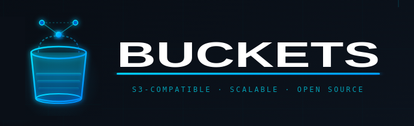

<p align="center">
  
</p>

# Buckets

A high-performance, S3-compatible object storage system written in C with support for fine-grained scalability.

## Overview

Buckets is a complete rewrite of object storage architecture that implements:

- **Fine-Grained Scalability**: Add/remove individual nodes (1-2 at a time) without cluster downtime
- **Location Registry**: Self-hosted metadata tracking for optimal read performance
- **Consistent Hashing**: Virtual node ring for minimal data migration during topology changes
- **S3 Compatibility**: Full Amazon S3 API compatibility
- **Erasure Coding**: Data protection with configurable redundancy
- **High Performance**: Written in C for maximum efficiency

## Architecture

Buckets implements a hybrid architecture combining:

1. **Location Registry** - Explicit object location tracking for <5ms reads
2. **Consistent Hashing** - Deterministic placement with ~20% migration on topology changes
3. **Topology Management** - Dynamic cluster membership with generation tracking
4. **Background Migration** - Automatic rebalancing when nodes are added/removed

See [architecture/SCALE_AND_DATA_PLACEMENT.md](architecture/SCALE_AND_DATA_PLACEMENT.md) for detailed design documentation.

## Key Features

- ✅ **Dynamic Node Management**: Add/remove nodes individually
- ✅ **Zero Downtime Operations**: Topology changes don't require restarts
- ✅ **Optimized Reads**: Direct lookup via registry (5-50× faster than multi-pool fan-out)
- ✅ **Controlled Migration**: ~20-30% data movement per node change
- ✅ **Fault Tolerant**: Graceful degradation, automatic recovery
- ✅ **Self-Contained**: No external dependencies (etcd, ZooKeeper, etc.)

## Building from Source

### Prerequisites

```bash
# Required
gcc >= 9.0
make >= 4.0
cmake >= 3.15

# Libraries
libssl-dev      # Cryptography
zlib1g-dev      # Compression
libuuid-dev     # UUID generation
```

### Build

```bash
make
```

### Install

```bash
sudo make install
```

## Quick Start

### Single Node

```bash
# Start server
buckets server /data

# Create a bucket
buckets-client mb local/mybucket

# Upload object
buckets-client cp myfile.txt local/mybucket/
```

### Distributed Cluster

```bash
# Start 4-node cluster
buckets server http://node{1...4}:9000/data{1...4}
```

### Add Node Dynamically

```bash
# Add individual node to existing cluster
buckets-admin cluster add-node http://node5:9000/data{1...4} --pool 0

# Check migration status
buckets-admin cluster migration-status
```

## Project Status

**Current Phase**: Foundation (Phase 1 of 5)

- [x] Architecture design complete
- [ ] Core data structures
- [ ] Erasure coding implementation
- [ ] Location registry
- [ ] Consistent hashing
- [ ] Migration engine
- [ ] S3 API handlers
- [ ] Admin interface

See [ROADMAP.md](ROADMAP.md) for detailed development timeline.

## Comparison with MinIO

Buckets is based on MinIO's architecture but with significant enhancements:

| Feature | MinIO | Buckets |
|---------|-------|---------|
| **Language** | Go | C |
| **Node Scalability** | Pool-level only | Individual nodes |
| **Read Latency (multi-pool)** | 10-50ms | <5ms |
| **Migration on Scale** | Add full pool | ~20% of data |
| **Dynamic Topology** | Requires restart | Zero downtime |
| **Memory Footprint** | ~500MB+ | Target <100MB |

## Documentation

- [Architecture Design](architecture/SCALE_AND_DATA_PLACEMENT.md) - Comprehensive technical specification
- [API Reference](docs/api/README.md) - S3 API compatibility
- [Admin Guide](docs/admin/README.md) - Cluster management
- [Developer Guide](docs/dev/README.md) - Contributing to Buckets

## Development

### Project Structure

```
buckets/
├── src/               # Source code
│   ├── core/         # Core data structures and algorithms
│   ├── registry/     # Location registry implementation
│   ├── hash/         # Consistent hashing
│   ├── erasure/      # Erasure coding
│   ├── storage/      # Storage layer
│   ├── s3/           # S3 API handlers
│   └── admin/        # Admin API
├── include/          # Public headers
├── tests/            # Unit and integration tests
├── docs/             # Documentation
├── architecture/     # Design documents
└── minio/            # Reference MinIO code
```

### Building Components

```bash
# Build core libraries
make core

# Build with tests
make test

# Build with debug symbols
make DEBUG=1

# Build specific component
make registry
```

### Running Tests

```bash
# All tests
make test

# Specific component
make test-registry

# With valgrind
make test-valgrind
```

## Contributing

We welcome contributions! Please see [CONTRIBUTING.md](CONTRIBUTING.md) for guidelines.

### Development Principles

1. **Performance First**: C gives us control - use it wisely
2. **Memory Safety**: Use valgrind, AddressSanitizer, static analysis
3. **Testability**: Every component has unit tests
4. **Documentation**: Code is read more than written
5. **Incremental Progress**: Small, reviewable changes

## License

GNU Affero General Public License v3.0 (AGPLv3)

See [LICENSE](LICENSE) for details.

## Credits

Buckets is inspired by and references the [MinIO](https://github.com/minio/minio) project.

## Community

- **Issues**: [GitHub Issues](https://github.com/yourusername/buckets/issues)
- **Discussions**: [GitHub Discussions](https://github.com/yourusername/buckets/discussions)
- **Security**: See [SECURITY.md](SECURITY.md)

---

**Status**: Active Development  
**Version**: 0.1.0-alpha  
**Started**: February 2026
